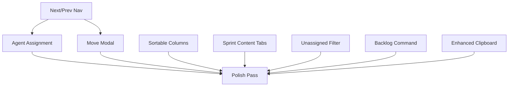

# Sprint/Task Module Enhancement Tickets

**Created**: October 12, 2025  
**Module**: Project Manager (Sprint/Task CRUD)  
**Priority**: Medium  
**Assigned**: Available for delegation

---

## Overview

Post-UAT enhancements for the Sprint/Task management module. Core functionality is complete (95%), these tickets add polish, usability improvements, and advanced features.

---

## Ticket 1: Agent Assignment Combobox Modal

**Priority**: High  
**Effort**: 3-4 hours  
**Skills**: React, TypeScript, Shadcn UI

### Description

Create a reusable agent assignment modal using Shadcn's Combobox component for both Sprint and Task detail views.

### Requirements

1. Create `AgentAssignmentModal.tsx` component
2. Use Shadcn Combobox for searchable agent list
3. Show agent name, designation, and avatar/icon
4. Add to "..." menu on Sprint and Task detail modals
5. API endpoint: `PATCH /api/orchestration/{type}/{id}/assign-agent`
6. Close on ESC or submit
7. Show success notification

### Acceptance Criteria

- [ ] Modal opens from "..." menu → "Assign Agent"
- [ ] Combobox searches agents by name/designation
- [ ] Selection updates assignee_id and creates audit log
- [ ] Modal closes after successful assignment
- [ ] Works for both sprints and tasks

### Files to Modify

- `resources/js/components/orchestration/AgentAssignmentModal.tsx` (create)
- `resources/js/components/orchestration/SprintDetailModal.tsx`
- `resources/js/components/orchestration/TaskDetailModal.tsx`
- `app/Http/Controllers/Orchestration/TaskController.php` (add assignAgent method)

---

## Ticket 2: Move Sprint/Task Modal

**Priority**: Medium  
**Effort**: 4-5 hours  
**Skills**: React, TypeScript, Laravel

### Description

Add "Move to Sprint" functionality with a command-style search modal showing mini sprint overview cards.

### Requirements

1. Create `MoveSelectorModal.tsx` component
2. Use Shadcn Command component for search
3. Display sprint cards with: ID, name, mini stats (task count, progress)
4. API endpoint: `PATCH /api/orchestration/tasks/{id}/move`
5. Update sprint_code and metadata
6. Create audit log entry

### Acceptance Criteria

- [ ] Modal opens from "..." menu → "Move to Sprint"
- [ ] Command box filters sprints as user types
- [ ] Sprint cards show overview without drilling down
- [ ] Selection moves task and refreshes view
- [ ] Audit log shows "Task moved from X to Y"

### Files to Create

- `resources/js/components/orchestration/MoveSelectorModal.tsx`
- Backend endpoint for move operation

---

## Ticket 3: Sortable Table Columns

**Priority**: Medium  
**Effort**: 2-3 hours  
**Skills**: React, TypeScript

### Description

Add column sorting to DataManagementModal for improved data navigation.

### Requirements

1. Add sort state to DataManagementModal
2. Show up/down arrows on sortable columns
3. Click to toggle sort direction
4. Support multi-column sort (shift+click)
5. Persist sort preference in localStorage

### Acceptance Criteria

- [ ] Column headers show sort indicators
- [ ] Click toggles sort direction (asc → desc → none)
- [ ] Sorted data updates immediately
- [ ] Sort state persists across modal opens
- [ ] Works for: code, title, created_at, status, priority

### Files to Modify

- `resources/js/components/ui/DataManagementModal.tsx`

---

## Ticket 4: Sprint Content Tabs (Copy Task Pattern)

**Priority**: Medium  
**Effort**: 3-4 hours  
**Skills**: React, Laravel

### Description

Add Agent/Plan/Context/Todo/Summary content tabs to Sprint detail, matching Task implementation.

### Requirements

1. Add content fields to WorkItem for sprint type
2. Add TipTap editors for each content tab
3. Copy tab structure from TaskDetailModal
4. Activity tab aggregates child task activities
5. API support for sprint content updates

### Acceptance Criteria

- [ ] Sprint detail shows same 5 content tabs as Task
- [ ] Each tab editable with TipTap markdown editor
- [ ] Activity tab shows sprint + all child task activities
- [ ] Content saves to sprint's content columns
- [ ] Audit logs content changes

### Files to Modify

- `resources/js/components/orchestration/SprintDetailModal.tsx`
- `app/Http/Controllers/Orchestration/SprintController.php` (create if needed)
- Database migration for content columns (if not exists)

---

## Ticket 5: Unassigned Tasks Filter on Tasks Page

**Priority**: Medium  
**Effort**: 2 hours  
**Skills**: Laravel, React

### Description

Move the "unassigned tasks" filter from Sprint list to Tasks page where it belongs.

### Requirements

1. Remove unassigned_tasks from `/sprints` response
2. Add filter to `/tasks` command handler
3. Add "Unassigned" filter option to task list
4. Default to showing all tasks, filter shows only unassigned

### Acceptance Criteria

- [ ] Sprint list no longer shows unassigned tasks
- [ ] Tasks page has "Assigned Status" filter
- [ ] Filter options: All, Assigned, Unassigned
- [ ] Query optimized for performance

### Files to Modify

- `app/Commands/Orchestration/SprintListCommand.php`
- `app/Commands/Orchestration/TaskListCommand.php`
- `resources/js/components/orchestration/TaskListModal.tsx` (via CommandResultModal config)

---

## Ticket 6: Backlog Command & Button

**Priority**: Medium  
**Effort**: 3 hours  
**Skills**: Laravel, React

### Description

Create `/backlog` command and UI access point for backlog management.

### Requirements

1. Create `/backlog` slash command
2. Create BacklogListCommand handler
3. Add "View Backlog" button to Sprint list page
4. Show tasks/sprints with status='backlog'
5. Support moving items in/out of backlog

### Acceptance Criteria

- [ ] `/backlog` command opens backlog view
- [ ] Button on sprint list opens backlog
- [ ] Backlog shows unscheduled items
- [ ] Actions: Move to Sprint, Archive, Delete
- [ ] Filter by type (sprint/task) and priority

### Files to Create

- `app/Commands/Orchestration/BacklogListCommand.php`
- Database command entry
- Optional: `resources/js/components/orchestration/BacklogListModal.tsx` (or use DataManagementModal)

---

## Ticket 7: Next/Previous Navigation (Advanced)

**Priority**: Low  
**Effort**: 6-8 hours  
**Skills**: React, Architecture

### Description

Add prev/next buttons to Sprint and Task detail modals for quick navigation through lists.

### Requirements

1. Pass list context to detail modals (current index, total count)
2. Add prev/next buttons to modal header
3. Execute next/prev commands without closing modal
4. Handle boundary conditions (first/last item)
5. Works within sprint context (task pagination bounded by sprint)

### Acceptance Criteria

- [ ] Prev/next buttons visible in header
- [ ] Clicking loads adjacent item without closing modal
- [ ] Buttons disabled at boundaries
- [ ] Task navigation respects current sprint filter
- [ ] Keyboard shortcuts (arrow keys)

### Files to Modify

- `resources/js/islands/chat/CommandResultModal.tsx`
- `resources/js/components/orchestration/SprintDetailModal.tsx`
- `resources/js/components/orchestration/TaskDetailModal.tsx`
- Navigation context needs architectural design

**Note**: This ticket requires architecture discussion before implementation.

---

## Ticket 8: Enhanced ID Display with Clipboard

**Priority**: Low  
**Effort**: 1 hour  
**Skills**: React

### Description

Extend clipboard copy functionality to all ID displays throughout the system.

### Requirements

1. Add CopyToClipboard to Sprint list rows
2. Add to Task list rows
3. Add to any modal showing IDs
4. Consistent positioning and styling

### Acceptance Criteria

- [ ] All displayed IDs have copy icon
- [ ] Icon shows check mark after copy
- [ ] Consistent 2-second feedback
- [ ] Accessible with keyboard (tab + enter)

### Files to Modify

- `resources/js/components/ui/DataManagementModal.tsx` (render IDs with copy)
- Any custom row renderers

---

## Ticket 9: Polish Pass

**Priority**: Low  
**Effort**: 2-3 hours  
**Skills**: UI/UX, React

### Description

General UI polish and consistency improvements.

### Requirements

1. Consistent spacing and alignment
2. Loading states for all async operations
3. Empty states with helpful CTAs
4. Error messages user-friendly
5. Animation consistency (toasts, modals, transitions)
6. Mobile responsive check

### Acceptance Criteria

- [ ] Visual consistency across all modals
- [ ] No jarring transitions
- [ ] All loading states shown
- [ ] Error messages actionable
- [ ] Mobile viewport works (if applicable)

---

## Dependencies Between Tickets



**Suggested Order:**
1. T3, T5, T8 (Quick wins, no dependencies)
2. T1, T2 (Core functionality)
3. T4, T6 (Feature completion)
4. T7 (Complex, requires arch discussion)
5. T9 (Final polish)

---

## Estimation Summary

| Ticket | Priority | Effort | Complexity |
|--------|----------|--------|------------|
| T1: Agent Assignment | High | 3-4h | Medium |
| T2: Move Modal | Medium | 4-5h | Medium |
| T3: Sortable Columns | Medium | 2-3h | Low |
| T4: Sprint Content Tabs | Medium | 3-4h | Low |
| T5: Unassigned Filter | Medium | 2h | Low |
| T6: Backlog Command | Medium | 3h | Low |
| T7: Next/Prev Nav | Low | 6-8h | High |
| T8: Enhanced Clipboard | Low | 1h | Low |
| T9: Polish Pass | Low | 2-3h | Low |
| **Total** | | **26-33h** | |

**Sprint Estimate**: 1 week with 2 developers, or 2 weeks with 1 developer

---

## Testing Checklist

For each ticket, verify:

- [ ] Feature works in browser
- [ ] No console errors
- [ ] Mobile responsive (if applicable)
- [ ] Keyboard accessible
- [ ] Loading states shown
- [ ] Error handling graceful
- [ ] Audit logs created
- [ ] Build succeeds
- [ ] TypeScript errors resolved

---

## Resources

- Shadcn UI Components: https://ui.shadcn.com/
- Current Sprint Implementation: `resources/js/components/orchestration/`
- API Controllers: `app/Http/Controllers/Orchestration/`
- Command Handlers: `app/Commands/Orchestration/`
- Module Architecture Doc: `docs/MODULE_ARCHITECTURE.md`

---

## Ticket 10: Eliminate Custom List Modals (Module System Refactor)

**Priority**: Low (Blocked by Module System v1.0)  
**Effort**: 8-12 hours  
**Skills**: PHP, Laravel, React, Architecture Design

### Description

Refactor custom list modals (`BacklogListModal`, `TaskListModal`, `SprintListModal`) to use schema-driven column definitions instead of hardcoded components. This requires the Module System from `MODULE_ARCHITECTURE.md` to be implemented first.

### Current Problem

Each data type requires a custom modal component because `DataManagementModal` doesn't have enough context to auto-generate appropriate columns:

```tsx
// Current: Hardcoded custom modals
BacklogListModal → Backlog-specific columns/filters (has_content badges, priority-first sort)
TaskListModal → Task-specific columns/filters
SprintListModal → Sprint-specific columns/filters (progress bars, status badges)
```

**Why This Exists:**
- `DataManagementModal` uses generic fallback columns based on `type_slug`
- Different views need different column definitions (backlog vs task list vs sprint list)
- Each custom modal duplicates table setup logic

### Future Solution (Schema-Driven)

```php
// Future: Module defines columns once, reused everywhere
Module::make('project-manager')
    ->types([
        Type::make('task')
            ->view('backlog', [
                'columns' => [
                    Column::text('task_code')->label('Task')->sortable(),
                    Column::badge('priority')->colors(['high' => 'red', 'medium' => 'yellow', 'low' => 'green']),
                    Column::badge('delegation_status')->label('Assignment'),
                    Column::custom('has_content')->render(HasContentBadges::class),
                ],
                'filters' => [
                    Filter::select('priority', ['high', 'medium', 'low']),
                    Filter::select('delegation_status', ['assigned', 'unassigned']),
                ],
                'query' => fn() => WorkItem::where('status', 'backlog'),
                'sort' => ['priority' => 'desc', 'created_at' => 'desc'],
            ])
            ->view('list', [...]) // Different view for /tasks
    ])
```

### Requirements

1. **Implement Module System Core** (prerequisite):
   - `Module`, `Type`, `Field`, `Column` builder classes
   - Schema-to-props transformation in `CommandResultModal`
   - Auto-column generation from schema

2. **Migrate Existing Modals**:
   - Define schemas for sprint, task, backlog views
   - Remove custom modal components
   - Update commands table to reference view configs

3. **Ensure Feature Parity**:
   - Custom renderers (progress bars, badges, has_content)
   - Specialized sorting (priority-first for backlog)
   - Expanded content panels
   - Filter configurations

### Acceptance Criteria

- [ ] Module system implemented (see `MODULE_ARCHITECTURE.md`)
- [ ] Sprint, Task, Backlog defined as schema-driven modules
- [ ] `/sprints`, `/tasks`, `/backlog` use `DataManagementModal` directly
- [ ] Custom modals removed: `BacklogListModal.tsx`, `TaskListModal.tsx`, `SprintListModal.tsx`
- [ ] All existing features preserved (filters, sorting, custom renderers)
- [ ] Navigation config still works (click row → detail view)

### Files to Modify/Remove

**Create:**
- `app/Modules/ProjectManager/ProjectManagerModule.php`
- `app/Services/ModuleRegistry.php`
- `app/Services/SchemaToPropsTransformer.php`

**Modify:**
- `resources/js/islands/chat/CommandResultModal.tsx` (use schema for columns)
- `database/seeders/CommandsSeeder.php` (add view configs)

**Remove:**
- `resources/js/components/orchestration/BacklogListModal.tsx`
- `resources/js/components/orchestration/TaskListModal.tsx`
- `resources/js/components/orchestration/SprintListModal.tsx` (maybe)

### Technical Debt Reason

**Why Custom Modal Exists (Today):**
- Backlog has unique fields (`has_content` object, different status logic)
- `DataManagementModal` tried to use generic `type_slug: 'task'` columns
- Failed with `Cannot read properties of undefined (reading 'toLowerCase')`
- Quick fix: Use custom `BacklogListModal` with explicit column definitions

**Why It's Technical Debt:**
- Violates DRY (each modal duplicates table setup)
- Hard to maintain (add field = update 3+ components)
- Not config-driven (hardcoded React components)
- Blocks module system vision (see MODULE_ARCHITECTURE.md § "Hardcoded Elements to Abstract")

### Related Documentation

- `docs/MODULE_ARCHITECTURE.md` - Module system design
- `docs/SPRINT_COMPONENT_GUIDE.md` - Current implementation
- `delegation/tasks/SPRINT-TASK-ENHANCEMENTS.md` - This file

### Notes

- Blocked by Module System v1.0 implementation
- Low priority (system works fine with custom modals)
- High value when Module System exists (unlocks CRM, Inventory, etc.)
- Can be tackled incrementally (migrate one view at a time)


---

## Ticket 11: Standardize /agents Command to Follow Sprint Pattern

**Priority**: Medium  
**Effort**: 2-3 hours  
**Skills**: PHP, React, TypeScript

### Description

The `/agents` command currently uses a mix of old patterns (explicit `component` in handler) and generic `DataManagementModal` in the database. Need to standardize it to follow the `/sprints` pattern with a proper custom modal wrapper.

### Current State

**Handler** (`App\Commands\Orchestration\Agent\ListCommand`):
```php
return [
    'type' => 'agent-profile',
    'component' => 'AgentProfileListModal',  // Explicit override
    'data' => $agents,
];
```

**Database** (`commands` table):
- `ui_modal_container`: `DataManagementModal` (generic)
- `navigation_config`: Has `data_prop: "agents"` but doesn't match handler output

**Available Components**:
- `AgentProfileListModal.tsx` - Exists but may be outdated
- `AgentProfileGridModal.tsx` - Exists, grid view option
- `AssignAgentModal.tsx` - New combobox modal (just created)

### Problem

1. Handler explicitly returns `component: 'AgentProfileListModal'` which bypasses database config
2. Database says `DataManagementModal` but command overrides it
3. Handler returns flat `data` array, not `{ agents: [...] }` structure
4. Doesn't follow standard pattern established by `/sprints`

### Requirements

1. **Remove explicit `component` from handler**:
   - Change to use `$this->respond(['agents' => $agents])`
   - Follow standard response pattern like Sprint/Backlog

2. **Update database config**:
   - Set `ui_modal_container: 'AgentProfileListModal'`
   - Ensure `navigation_config.data_prop: "agents"` matches response

3. **Verify/Update `AgentProfileListModal.tsx`**:
   - Should wrap `DataManagementModal` like `SprintListModal` does
   - Add filters: Status (active/inactive/all), Mode (implementation/coordination/enablement)
   - Add search on name, slug, description
   - Show agent cards or table rows with capabilities preview
   - Click row → open agent detail (if detail view exists, else show expanded content)

4. **Optional: Create `AgentDetailModal.tsx`** (if not exists):
   - Show full agent profile
   - List capabilities, constraints, tools
   - Show assignment history (active_assignments, total_assignments)
   - Inline edit capabilities similar to TaskDetailModal

5. **Update `CommandsSeeder.php`**:
   - Set correct `ui_modal_container`
   - Add proper `navigation_config` with detail command if applicable

### Acceptance Criteria

- [ ] `/agents` command loads without explicit component override
- [ ] Uses `AgentProfileListModal` (custom wrapper following sprint pattern)
- [ ] Shows filter chips (status, mode, type)
- [ ] Search works across name, slug, description
- [ ] Rows clickable if detail view exists
- [ ] Response structure: `{ agents: [...] }` not flat array
- [ ] Database config matches actual implementation
- [ ] No console errors or warnings

### Files to Modify

**Backend:**
- `app/Commands/Orchestration/Agent/ListCommand.php` - Remove explicit component
- `database/seeders/CommandsSeeder.php` - Update config

**Frontend:**
- `resources/js/components/orchestration/AgentProfileListModal.tsx` - Verify/update
- `resources/js/components/orchestration/AgentDetailModal.tsx` - Create if needed

### Success Metrics

- `/agents` follows same pattern as `/sprints` and `/backlog`
- Easy to understand for new developers (no magic overrides)
- Consistent with established conventions
- Ready for future module system migration

### Related

- See `docs/BACKLOG_SPRINT_ASSIGNMENT_IMPLEMENTATION.md` for pattern reference
- See `/sprints` command as reference implementation
- Related to technical debt: all commands should follow same pattern

