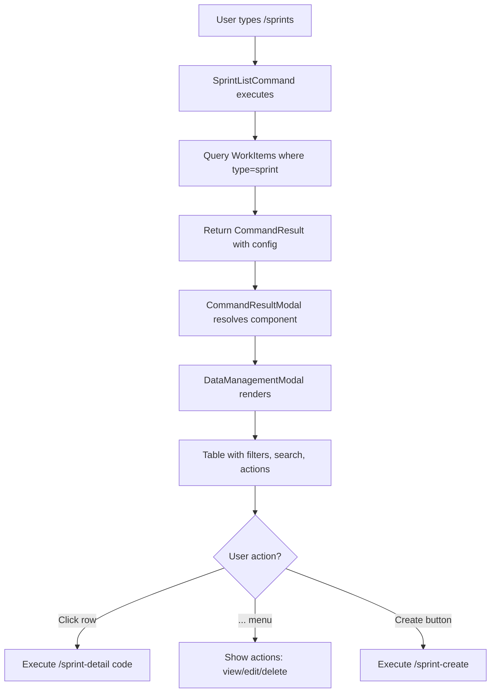
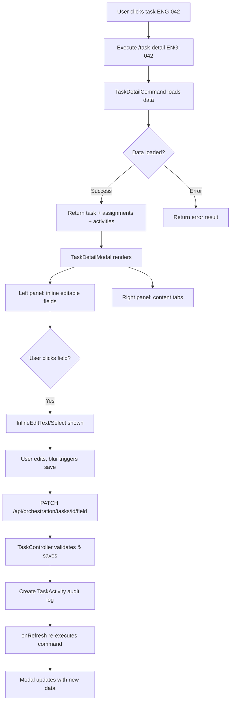
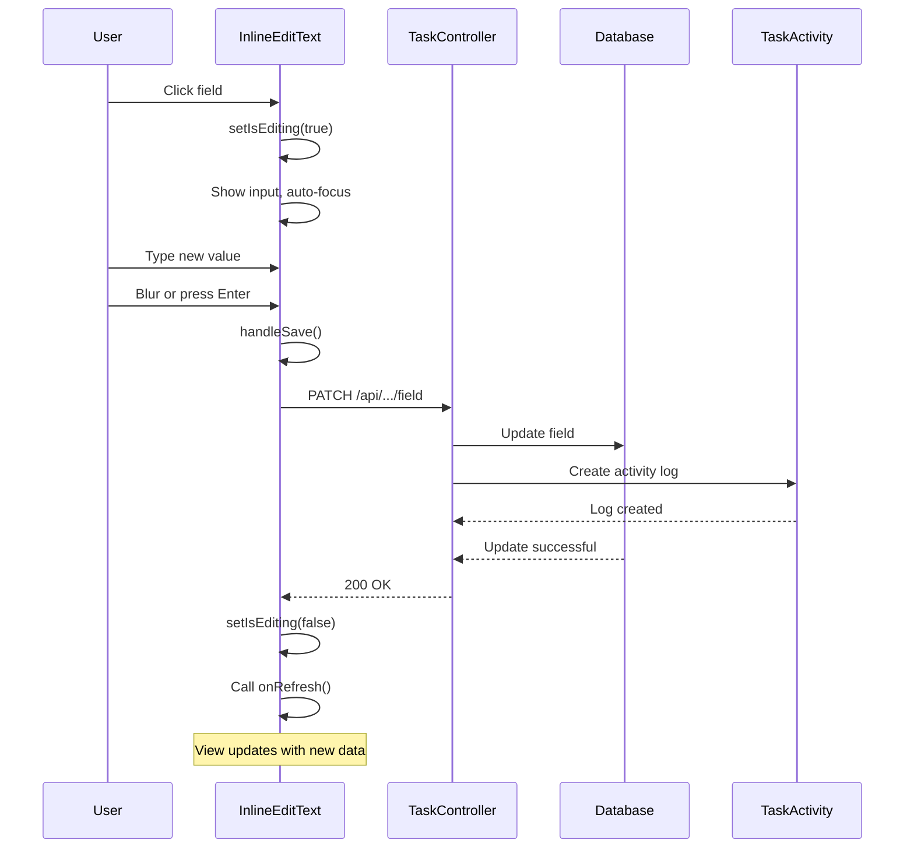

# Sprint/Task Management Component - Complete Guide

**Version**: 1.0  
**Last Updated**: October 12, 2025  
**Status**: Production Ready (95% complete)

---

## Table of Contents

1. [Overview](#overview)
2. [Architecture](#architecture)
3. [Component Flow](#component-flow)
4. [Data Model](#data-model)
5. [User Journey](#user-journey)
6. [Component Reference](#component-reference)
7. [API Reference](#api-reference)
8. [Configuration](#configuration)
9. [Extension Guide](#extension-guide)
10. [Troubleshooting](#troubleshooting)

---

## Overview

The Sprint/Task Management Component is a complete CRUD system for managing sprints and tasks in an agile workflow. It demonstrates the **Fragments Engine** pattern for building config-driven, modal-based business modules.

### Key Features

- ✅ Full CRUD operations (Create, Read, Update, Delete)
- ✅ Inline editing with autosave
- ✅ Rich markdown content editing (TipTap)
- ✅ Nested navigation (Sprint → Tasks)
- ✅ Filtering, sorting, search
- ✅ Action menus (view, edit, assign, delete)
- ✅ Automatic audit logging
- ✅ Tag management
- ✅ Agent assignment
- ✅ Sprint assignment
- ✅ Responsive modal UI
- ✅ Keyboard navigation
- ✅ Copy-to-clipboard helpers

### Technology Stack

**Frontend:**
- React 18 + TypeScript
- Shadcn UI components
- TipTap (WYSIWYG editor)
- TailwindCSS

**Backend:**
- Laravel 12
- PostgreSQL with vector extension
- Command pattern architecture
- JSON configuration in database

---

## Architecture

### System Layers

```
┌─────────────────────────────────────────────────────────────┐
│                        User Layer                            │
│  /sprints → /sprint-detail → /task-detail                   │
└─────────────────────────────────────────────────────────────┘
                            ↓
┌─────────────────────────────────────────────────────────────┐
│                    Command Layer                             │
│  SprintListCommand → SprintDetailCommand → TaskDetailCommand│
└─────────────────────────────────────────────────────────────┘
                            ↓
┌─────────────────────────────────────────────────────────────┐
│                   Presentation Layer                         │
│  CommandResultModal → SprintListModal → TaskDetailModal     │
└─────────────────────────────────────────────────────────────┘
                            ↓
┌─────────────────────────────────────────────────────────────┐
│                      API Layer                               │
│  TaskController → updateField, updateTags, getAvailableSprints│
└─────────────────────────────────────────────────────────────┘
                            ↓
┌─────────────────────────────────────────────────────────────┐
│                     Data Layer                               │
│  WorkItem (polymorphic) → TaskActivity (audit)              │
└─────────────────────────────────────────────────────────────┘
```

### Navigation Stack Pattern

The system uses a **navigation stack** instead of nested dialogs to avoid focus trap issues:

```
Stack: []
User types: /sprints
Stack: [SprintListResult]
  ↓
User clicks sprint "SPR-001"
Stack: [SprintListResult, SprintDetailResult]
  ↓
User clicks task "ENG-042"
Stack: [SprintListResult, SprintDetailResult, TaskDetailResult]
  ↓
User presses ESC
Stack: [SprintListResult, SprintDetailResult]
  ↓
User presses ESC
Stack: [SprintListResult]
  ↓
User presses ESC or clicks X
Stack: []  (modal closes)
```

**Key Implementation:**
```typescript
// CommandResultModal.tsx
const [viewStack, setViewStack] = useState<CommandResult[]>([])

const executeDetailCommand = async (detailCommand: string) => {
  const detailResult = await fetch('/api/commands/execute', {
    body: JSON.stringify({ command: detailCommand })
  })
  setViewStack(prev => [...prev, detailResult]) // Push to stack
}

const handleBack = () => {
  if (viewStack.length === 0) {
    onClose() // Close modal
  } else {
    setViewStack(prev => prev.slice(0, -1)) // Pop stack
  }
}
```

---

## Component Flow

### Sprint List Flow



### Task Detail Flow



### Inline Edit Flow



---

## Data Model

### WorkItem Table (Polymorphic)

```sql
work_items
├── id (UUID, PK)
├── type (VARCHAR) -- 'sprint' | 'task' | 'bug' | 'epic'
├── parent_id (UUID, FK to work_items) -- For task → sprint relationship
├── assignee_type (VARCHAR) -- 'agent' | 'user'
├── assignee_id (UUID) -- FK to agent_profiles or users
├── status (VARCHAR) -- 'backlog' | 'todo' | 'in_progress' | 'review' | 'done'
├── priority (VARCHAR) -- 'low' | 'medium' | 'high'
├── project_id (UUID, FK)
├── tags (JSON[]) -- ['backend', 'api', 'urgent']
├── state (JSON) -- Custom state data
├── metadata (JSON) -- Type-specific fields:
│   ├── code (sprint_code | task_code)
│   ├── title | task_name
│   ├── description
│   ├── sprint_code (for tasks)
│   └── estimate_text
├── delegation_status (VARCHAR)
├── delegation_context (JSON)
├── delegation_history (JSON)
├── estimated_hours (DECIMAL)
├── actual_hours (DECIMAL)
├── agent_content (TEXT) -- Markdown
├── plan_content (TEXT) -- Markdown
├── context_content (TEXT) -- Markdown
├── todo_content (TEXT) -- Markdown
├── summary_content (TEXT) -- Markdown
├── pr_url (VARCHAR)
├── completed_at (TIMESTAMP)
├── created_at (TIMESTAMP)
└── updated_at (TIMESTAMP)
```

### TaskActivity Table (Audit Log)

```sql
task_activities
├── id (UUID, PK)
├── task_id (UUID, FK to work_items)
├── agent_id (UUID, FK to agent_profiles, nullable)
├── user_id (BIGINT, FK to users, nullable)
├── activity_type (ENUM)
│   ├── 'status_change'
│   ├── 'content_update'
│   ├── 'assignment'
│   ├── 'note'
│   ├── 'error'
│   └── 'artifact_attached'
├── action (VARCHAR) -- 'field_updated', 'agent_assigned', etc.
├── description (TEXT) -- Human-readable: "Status changed from todo to in_progress"
├── changes (JSON) -- { field: 'status', old_value: 'todo', new_value: 'in_progress' }
├── metadata (JSON) -- Additional context
└── created_at (TIMESTAMP)
```

### Commands Table (Configuration)

```sql
commands
├── id (BIGINT, PK)
├── command (VARCHAR, UNIQUE) -- '/sprints', '/sprint-detail {code}'
├── handler_class (VARCHAR) -- 'App\Commands\Orchestration\SprintListCommand'
├── description (TEXT)
├── type_slug (VARCHAR) -- Links to types_registry
├── ui_modal_container (VARCHAR) -- 'DataManagementModal'
├── navigation_config (JSON)
│   ├── data_prop: 'sprints'
│   ├── item_key: 'code'
│   ├── detail_command: '/sprint-detail'
│   ├── parent_command: '/sprints' (for detail views)
│   └── children: [{ type: 'task', command: '/task-detail', item_key: 'task_code' }]
├── ui_config (JSON) -- Filters, sorts, columns, etc.
├── created_at (TIMESTAMP)
└── updated_at (TIMESTAMP)
```

---

## User Journey

### Creating a Sprint

```
1. User: "/sprints" in chat
   → System shows sprint list

2. User: Clicks "Create Sprint" button
   → System opens SprintFormModal

3. User: Fills form (code, title, description, status, priority)
   → System validates in real-time

4. User: Clicks "Create"
   → System executes /sprint-create command
   → POST /api/sprints
   → Creates WorkItem with type='sprint'
   → Returns to sprint list with new sprint visible

5. System: Shows success toast
   → "Sprint SPR-042 created successfully"
```

### Editing Task Details (Inline)

```
1. User: Clicks task "ENG-042" from sprint detail
   → System opens TaskDetailModal

2. User: Sees task name "Implement API endpoint"

3. User: Clicks task name field
   → Field transforms to editable input
   → Input auto-focuses and selects text

4. User: Types "Implement REST API endpoint"

5. User: Presses Enter or clicks outside
   → System auto-saves via PATCH /api/orchestration/tasks/{id}/field
   → Field reverts to display mode showing new value
   → Activity tab shows "Task name updated" with timestamp

6. System: Success (silent, no toast needed)
   → Modal refreshes data
   → Change persisted and logged
```

### Navigating Sprint → Task

```
1. User: "/sprints"
   → Sprint list modal opens
   → Navigation stack: [SprintListResult]

2. User: Clicks "SPR-042"
   → System executes "/sprint-detail SPR-042"
   → Sprint detail opens with task list
   → Navigation stack: [SprintListResult, SprintDetailResult]
   → Header shows "Back" button

3. User: Clicks task "ENG-001"
   → System executes "/task-detail ENG-001"
   → Task detail opens
   → Navigation stack: [SprintListResult, SprintDetailResult, TaskDetailResult]
   → Header shows "Back" button

4. User: Presses ESC
   → System pops navigation stack
   → Returns to sprint detail
   → Navigation stack: [SprintListResult, SprintDetailResult]

5. User: Presses ESC again
   → System pops navigation stack
   → Returns to sprint list
   → Navigation stack: [SprintListResult]

6. User: Presses ESC or clicks X
   → System closes modal
   → Returns to chat interface
```

---

## Component Reference

### 1. SprintListModal (via DataManagementModal)

**Purpose**: Display list of sprints with filters and actions

**Props** (passed via CommandResultModal):
```typescript
{
  isOpen: boolean
  onClose: () => void
  title: string
  data: Sprint[]
  columns: ColumnDefinition[]
  filters: FilterDefinition[]
  searchFields: string[]
  searchPlaceholder: string
  actionItems: ActionDefinition[]
  onAction: (action: string, item: Sprint) => void
  clickableRows: boolean
  onRowClick: (sprint: Sprint) => void
}
```

**Columns**:
- Code (sortable, clickable)
- Title (sortable)
- Status (badge)
- Progress (percentage bar)
- Total Tasks (count)
- Created (date, sortable)

**Filters**:
- Status: Planning | Active | Completed | All
- Priority: Low | Medium | High | All

**Actions** (...menu):
- View Details
- Edit Sprint
- Delete Sprint

---

### 2. SprintDetailModal

**Purpose**: Show sprint details with nested task list

**Props**:
```typescript
{
  isOpen: boolean
  onClose: () => void
  onBack: () => void
  sprint: SprintDetail
  tasks: Task[]
  stats: { total: number, completed: number, ... }
  loading?: boolean
  error?: string | null
  onRefresh?: () => void
  onTaskSelect?: (task: Task) => void
}
```

**Sections**:
- **Header**: Sprint code, title, back button
- **Stats Bar**: Total tasks, completed, in progress, todo
- **Task List**: Embedded DataManagementModal
  - Filters: All | In Progress | Todo | Done
  - Columns: Code, Name, Status, Priority, Assigned To
  - Actions: View, Assign Agent

---

### 3. SprintFormModal

**Purpose**: Create or edit sprint

**Props**:
```typescript
{
  isOpen: boolean
  onClose: () => void
  sprint?: Sprint // For edit mode
  onSubmit: (data: SprintFormData) => Promise<void>
}
```

**Fields**:
- Code (text, required, unique)
- Title (text, required)
- Description (textarea)
- Status (select: planning|active|completed)
- Priority (select: low|medium|high)
- Estimated Hours (number)

**Validation**:
- Code: required, alphanumeric with dashes
- Title: required, min 3 chars
- Status: required, one of allowed values

---

### 4. TaskDetailModal

**Purpose**: View and edit task details with inline editing

**Props**:
```typescript
{
  isOpen: boolean
  onClose: () => void
  onBack?: () => void
  task: Task
  currentAssignment?: Assignment
  assignments?: Assignment[]
  content?: TaskContent
  activities?: TaskActivity[]
  onRefresh?: () => void
  onAddNote?: (note: string) => Promise<void>
}
```

**Layout**:
```
┌─────────────────────────────────────────────────┐
│ Header: Task: ENG-042           [Back] [X]      │
├─────────────┬───────────────────────────────────┤
│             │  Tabs: Activity | Agent | Plan | │
│  Details    │        Context | Todo | Summary   │
│  Panel      │                                   │
│             │  Tab Content Area                 │
│  - Name ✏️  │  (Activity timeline or markdown)  │
│  - Desc ✏️  │                                   │
│  - Status 🔽│                                   │
│  - Priority │                                   │
│  - Sprint 🔽│                                   │
│  - Agent 🔽 │                                   │
│  - Estimate │                                   │
│  - Tags     │                                   │
│             │                                   │
│  Assignment │                                   │
│  History    │                                   │
│             │                                   │
└─────────────┴───────────────────────────────────┘
│ Task ID: uuid [📋]  Code: ENG-042 [📋]  [Close]│
└─────────────────────────────────────────────────┘
```

**Inline Editable Fields**:
1. Task Name → InlineEditText
2. Description → InlineEditText (multiline)
3. Status → InlineEditSelect
4. Priority → InlineEditSelect
5. Sprint → InlineEditSelect (dynamic options)
6. Agent → InlineEditSelect (dynamic options)
7. Estimate → InlineEditText
8. Tags → TagEditor

**Content Tabs**:
1. **Activity**: Timeline of all changes, add notes
2. **Agent**: Markdown content for agent instructions
3. **Plan**: Markdown content for task plan
4. **Context**: Markdown content for context/background
5. **Todo**: Markdown checklist
6. **Summary**: Markdown summary/notes

---

### 5. Shared Components

#### InlineEditText

**Purpose**: Click-to-edit text field with autosave

**Usage**:
```tsx
<InlineEditText
  value={task.task_name || ''}
  onSave={(value) => handleSaveField('task_name', value)}
  placeholder="Click to edit"
  multiline={false}
  className="text-sm"
/>
```

**Behavior**:
- Click: Enter edit mode, focus input
- Enter: Save and exit edit mode
- Escape: Cancel and revert
- Blur: Save and exit edit mode

---

#### InlineEditSelect

**Purpose**: Click badge to open dropdown selector

**Usage**:
```tsx
<InlineEditSelect
  value={task.status}
  options={[
    { value: 'todo', label: 'Todo' },
    { value: 'in_progress', label: 'In Progress' },
    { value: 'done', label: 'Done' },
  ]}
  onSave={(value) => handleSaveField('status', value)}
  className="inline-block"
/>
```

**Behavior**:
- Click badge: Open dropdown
- Select option: Save and close
- Click outside: Close without saving
- Escape: Close without saving

---

#### TagEditor

**Purpose**: Add/remove tags with auto-save

**Usage**:
```tsx
<TagEditor
  tags={task.tags || []}
  onSave={(tags) => handleSaveTags(tags)}
  placeholder="Add tag..."
  maxTags={10}
/>
```

**Behavior**:
- Type tag name
- Press Enter: Add tag and save
- Click X on tag: Remove and save
- Prevents duplicates

---

#### MarkdownEditor (TipTap)

**Purpose**: WYSIWYG markdown editor for content fields

**Usage**:
```tsx
<MarkdownEditor
  content={task.agent_content || ''}
  onSave={(content) => handleSaveContent('agent_content', content)}
  onCancel={() => setEditMode(false)}
  minHeight="400px"
/>
```

**Features**:
- Toolbar: Bold, Italic, Headings, Lists, Code
- Auto-converts to markdown on save
- Keyboard shortcuts (Ctrl+B, Ctrl+I)
- Fills container height

---

#### CopyToClipboard

**Purpose**: Copy text to clipboard with visual feedback

**Usage**:
```tsx
<CopyToClipboard text={task.id} />
```

**Behavior**:
- Click: Copy to clipboard
- Show checkmark for 2 seconds
- Icon-only button (minimal)

---

## API Reference

### Task Endpoints

#### Update Single Field
```http
PATCH /api/orchestration/tasks/{id}/field
Content-Type: application/json

{
  "field": "task_name",
  "value": "New task name"
}

Response 200:
{
  "success": true,
  "task": { ... }
}
```

**Supported Fields**:
- `task_name`, `description`, `status`, `priority`
- `sprint_code`, `estimate_text`, `assignee_id`
- `agent_content`, `plan_content`, `context_content`, `todo_content`, `summary_content`

---

#### Update Tags
```http
PATCH /api/orchestration/tasks/{id}/tags
Content-Type: application/json

{
  "tags": ["backend", "api", "high-priority"]
}

Response 200:
{
  "success": true,
  "task": { ... }
}
```

---

#### Get Available Sprints
```http
GET /api/orchestration/tasks/sprints/available

Response 200:
{
  "sprints": [
    { "value": "SPR-001", "label": "SPR-001 - Sprint Title" },
    { "value": "SPR-002", "label": "SPR-002 - Another Sprint" }
  ]
}
```

---

### Command Execution

All commands are executed via:
```http
POST /api/commands/execute
Content-Type: application/json
X-CSRF-TOKEN: {token}

{
  "command": "/sprint-detail SPR-001"
}

Response 200:
{
  "success": true,
  "type": "sprint-detail",
  "data": {
    "sprint": { ... },
    "tasks": [ ... ],
    "stats": { ... }
  },
  "config": {
    "ui": {
      "modal_container": "SprintDetailModal",
      "navigation": { ... }
    },
    "type": {
      "slug": "sprint",
      "display_name": "Sprint"
    }
  }
}
```

---

## Configuration

### Database Configuration (commands table)

Example for `/sprints` command:

```json
{
  "command": "/sprints",
  "handler_class": "App\\Commands\\Orchestration\\SprintListCommand",
  "type_slug": "sprint",
  "ui_modal_container": "DataManagementModal",
  "navigation_config": {
    "data_prop": "sprints",
    "item_key": "code",
    "detail_command": "/sprint-detail"
  },
  "ui_config": {
    "filters": [
      {
        "key": "status",
        "label": "Status",
        "options": [
          { "value": "planning", "label": "Planning" },
          { "value": "active", "label": "Active" },
          { "value": "completed", "label": "Completed" },
          { "value": "all", "label": "All" }
        ],
        "default": "active"
      }
    ],
    "search_fields": ["code", "title", "description"],
    "sortable_columns": ["code", "title", "created_at", "status"]
  }
}
```

---

## Extension Guide

### Adding a New Inline Editable Field

1. **Add to Task interface**:
```typescript
// TaskDetailModal.tsx
interface Task {
  // ... existing fields
  new_field?: string
}
```

2. **Add to TaskController validation**:
```php
// app/Http/Controllers/Orchestration/TaskController.php
'field' => 'required|string|in:...,new_field',
```

3. **Add to field handling**:
```php
$oldValue = match ($field) {
    // ... existing fields
    'new_field' => Arr::get($task->metadata, 'new_field'),
};
```

4. **Add to UI**:
```tsx
<div>
  <span className="text-sm font-medium">New Field:</span>
  <InlineEditText 
    value={task.new_field || ''}
    onSave={(value) => handleSaveField('new_field', value)}
  />
</div>
```

---

### Adding a New Content Tab

1. **Add column to work_items** (if needed):
```sql
ALTER TABLE work_items ADD COLUMN custom_content TEXT;
```

2. **Add to TaskController validation**:
```php
'field' => 'required|string|in:...,custom_content',
```

3. **Add to contentTabs array**:
```tsx
const contentTabs = [
  // ... existing tabs
  { 
    key: 'custom', 
    label: 'Custom', 
    icon: <Icon />, 
    content: safeContent.custom 
  },
]
```

4. **Update fieldMap in handleSaveContent**:
```typescript
const fieldMap: Record<string, string> = {
  // ... existing mappings
  'custom': 'custom_content',
}
```

---

### Adding a New Action Menu Item

1. **Add to actionItems array**:
```typescript
const actionItems = [
  // ... existing actions
  { key: 'custom-action', label: 'Custom Action' },
]
```

2. **Handle in onAction**:
```typescript
onAction={(action, item) => {
  if (action === 'custom-action') {
    // Execute custom command or API call
    handleCustomAction(item)
  }
}}
```

---

## Troubleshooting

### Modal Freezes After Opening Dropdown

**Symptom**: After clicking "..." menu, modal becomes unresponsive

**Cause**: DropdownMenu creates focus trap by default

**Solution**: Add `modal={false}` prop
```tsx
<DropdownMenu modal={false}>
  <DropdownMenuTrigger>...</DropdownMenuTrigger>
  <DropdownMenuContent>...</DropdownMenuContent>
</DropdownMenu>
```

---

### Double ESC Required to Close Modal

**Symptom**: First ESC doesn't close modal, need second ESC

**Cause**: Same as above - dropdown consuming first ESC

**Solution**: Same as above - `modal={false}`

---

### Inline Edit Content Disappears

**Symptom**: Type text, blur field, content vanishes

**Cause**: Missing `whitespace-pre-wrap` for multiline

**Solution**:
```tsx
className={`... ${multiline ? 'whitespace-pre-wrap' : ''}`}
```

---

### TipTap Editor Only Shows Toolbar

**Symptom**: Editor doesn't fill container height

**Cause**: Fixed min-height instead of flex layout

**Solution**:
```tsx
<div className="flex flex-col h-full">
  <div className="flex-shrink-0">{toolbar}</div>
  <div className="flex-1 overflow-auto">{editor}</div>
</div>
```

---

## Summary

The Sprint/Task component demonstrates a complete, production-ready implementation of the Fragments Engine pattern. It serves as a blueprint for building similar business modules with:

- **Config-driven UI** (no hardcoded components)
- **Navigation stack pattern** (no nested dialogs)
- **Inline editing** (modern, intuitive UX)
- **Automatic audit logs** (compliance-ready)
- **Extensible architecture** (easy to customize)

Use this guide to onboard new developers or as a reference when building your next module (CRM, Inventory, etc.).

---

**Need Help?**

- Check `docs/MODULE_ARCHITECTURE.md` for module system design
- Review `delegation/tasks/SPRINT-TASK-ENHANCEMENTS.md` for remaining tickets
- See `docs/INLINE_EDITING_IMPLEMENTATION_SUMMARY.md` for technical details
