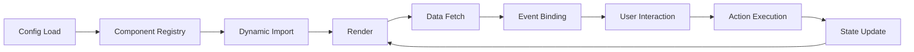

# Fragments Engine v2 UI System - Architecture Guide

## System Overview

The Fragments Engine v2 UI System is a configuration-driven, component-based architecture that enables dynamic UI generation from JSON configurations stored in a database. The system separates concerns across multiple layers and provides a flexible framework for building complex user interfaces without code changes.

## Core Architecture Principles

### 1. Configuration-First Design
- All UI layouts and behaviors defined in JSON
- Database-backed configuration storage
- Version-controlled with hash-based change detection
- Hot-reloadable without deployments

### 2. Component-Based Architecture
- Reusable, composable UI components
- Lazy-loaded for optimal performance
- Category-based organization
- Event-driven communication

### 3. Data Source Abstraction
- Decoupled data fetching from UI rendering
- Capability-based querying
- Pluggable resolver system
- Unified data access patterns

## System Layers

```
┌─────────────────────────────────────────────────────────┐
│                    Frontend (React)                      │
├─────────────────────────────────────────────────────────┤
│                  Component Registry                      │
├─────────────────────────────────────────────────────────┤
│                   Event Bus System                       │
├─────────────────────────────────────────────────────────┤
│                    API Layer (v2)                        │
├─────────────────────────────────────────────────────────┤
│              Configuration Management                    │
├─────────────────────────────────────────────────────────┤
│                 DataSource Resolvers                     │
├─────────────────────────────────────────────────────────┤
│                  Action Processors                       │
├─────────────────────────────────────────────────────────┤
│                  Database (PostgreSQL)                   │
└─────────────────────────────────────────────────────────┘
```

## Component Architecture

### Component Hierarchy

```
ComponentRegistry
├── Primitives (21 components)
│   ├── Button, Input, Label, Badge
│   ├── Avatar, Skeleton, Spinner
│   ├── Typography variants
│   └── Form controls
├── Layouts (10 components)
│   ├── Card, ScrollArea, Resizable
│   ├── AspectRatio, Collapsible
│   └── Accordion
├── Navigation (10 components)
│   ├── Tabs, Breadcrumb, Pagination
│   └── Sidebar
├── Composites (13 components)
│   ├── Dialog, Popover, Tooltip
│   ├── Sheet, Drawer
│   └── Menus
├── Advanced (3 components)
│   ├── DataTable
│   ├── Chart
│   └── Carousel
└── Forms (7 components)
    ├── Form, InputGroup
    ├── DatePicker, Calendar
    └── Toggle controls
```

### Component Lifecycle



### Component Configuration Schema

```typescript
interface ComponentConfig {
  id: string;                    // Unique identifier
  type: string;                   // Component type
  props?: Record<string, any>;   // Component-specific properties
  dataSource?: string;            // Data source alias
  actions?: Record<string, ActionConfig>;  // Action handlers
  children?: ComponentConfig[];   // Nested components
}
```

## Data Flow Architecture

### Request Flow

```
User Action → Component → Event Bus → API Call → DataSource Resolver → Database
     ↑                                                                      ↓
     └──────────── Component Re-render ← State Update ← Response ←─────────┘
```

### DataSource Resolution

```typescript
interface DataSourceResolver {
  query(params: QueryParams): Promise<DataResult>;
  getCapabilities(): Capabilities;
  validate(params: QueryParams): boolean;
}

interface QueryParams {
  search?: string;
  filters?: Record<string, any>;
  sort?: SortConfig;
  pagination?: PaginationConfig;
}
```

## Event System Architecture

### Event Bus Pattern

The system uses a centralized event bus for component communication:

```typescript
// Event emission
window.dispatchEvent(new CustomEvent('component:search', {
  detail: { target: 'component.table.agent', search: value }
}));

// Event listening
window.addEventListener('component:search', (event) => {
  if (event.detail.target === componentId) {
    handleSearch(event.detail.search);
  }
});
```

### Event Types

1. **Component Events**
   - `component:search` - Search requests
   - `component:filter` - Filter changes
   - `component:sort` - Sort changes
   - `component:select` - Selection changes

2. **Action Events**
   - `command:execute` - Command execution
   - `action:navigate` - Navigation requests
   - `modal:open` - Modal triggers
   - `modal:close` - Modal closure

3. **System Events**
   - `config:reload` - Configuration refresh
   - `data:refresh` - Data reload
   - `error:boundary` - Error handling

## Configuration Management

### Storage Structure

```sql
-- Pages table
fe_ui_pages
├── id (primary key)
├── key (unique identifier)
├── config (JSON configuration)
├── hash (SHA-256 of config)
├── version (auto-incrementing)
└── timestamps

-- Components table (reusable)
fe_ui_components
├── id
├── key
├── type
├── config
├── hash
├── version
└── timestamps

-- DataSources registry
fe_ui_datasources
├── id
├── alias
├── model_class
├── resolver_class
├── capabilities (JSON)
└── timestamps
```

### Version Management

```php
// Automatic hash computation on save
class FeUiPage extends Model {
    protected static function booted() {
        static::saving(function ($page) {
            $newHash = hash('sha256', json_encode($page->config));
            if ($page->hash !== $newHash) {
                $page->hash = $newHash;
                $page->version++;
            }
        });
    }
}
```

## Action System Architecture

### Action Types

```typescript
type ActionType = 'command' | 'navigate' | 'emit' | 'http' | 'modal';

interface ActionConfig {
  type: ActionType;
  command?: string;
  url?: string;
  event?: string;
  method?: HttpMethod;
  payload?: Record<string, any>;
  modal?: ModalConfig;
}
```

### Action Processing Pipeline

```
Action Trigger → Validation → Middleware → Execution → Response Handler
                     ↓                         ↓              ↓
                  Error Handler ←──────────────┴──────────────┘
```

## API Architecture

### Endpoint Structure

```
/api/v2/ui/
├── pages/{key}                 # Page configuration
├── datasource/{alias}/
│   ├── query                   # Data querying
│   └── capabilities            # Available operations
├── types/{alias}/
│   ├── {id}                    # Single record
│   └── query                   # Type-based queries
└── action                      # Action execution
```

### Request/Response Patterns

```typescript
// DataSource Query Request
POST /api/v2/ui/datasource/Agent/query
{
  "search": "john",
  "filters": { "status": "active" },
  "sort": { "field": "name", "direction": "asc" },
  "pagination": { "page": 1, "per_page": 15 }
}

// Response
{
  "data": [...],
  "meta": {
    "total": 100,
    "page": 1,
    "per_page": 15,
    "last_page": 7
  },
  "hash": "abc123..."
}
```

## Security Architecture

### Authorization Layers

1. **Route Level** - Middleware authentication
2. **DataSource Level** - Query authorization
3. **Action Level** - Command authorization
4. **Field Level** - Data filtering

### Security Considerations

```php
class DataSourceResolver {
    public function authorize($user, $operation) {
        // Check user permissions
        // Validate operation scope
        // Apply row-level security
    }
    
    public function sanitize($params) {
        // Validate input parameters
        // Prevent SQL injection
        // Sanitize search terms
    }
}
```

## Performance Architecture

### Optimization Strategies

1. **Component Lazy Loading**
   ```typescript
   import('./components/DataTableComponent').then(({ DataTableComponent }) => {
     registry.register('data-table', DataTableComponent);
   });
   ```

2. **Request Caching**
   ```typescript
   const cache = new Map();
   const cacheKey = `${dataSource}:${JSON.stringify(params)}`;
   if (cache.has(cacheKey)) return cache.get(cacheKey);
   ```

3. **Virtual Scrolling** (Planned)
   - For large datasets in tables
   - Render only visible rows
   - Recycle DOM elements

4. **Debouncing**
   - Search inputs (300ms)
   - Filter changes (500ms)
   - Window resize (100ms)

## Scalability Considerations

### Horizontal Scaling

- Stateless API design
- Database-backed configuration
- CDN-ready static assets
- Cache-friendly responses

### Vertical Scaling

- Lazy component loading
- Paginated data fetching
- Optimistic UI updates
- Background job processing

## Extension Points

### Adding New Components

1. Create component implementation
2. Register in ComponentRegistry
3. Define TypeScript interfaces
4. Add to component categories
5. Document configuration schema

### Adding DataSource Resolvers

1. Implement resolver interface
2. Register in database
3. Define capabilities
4. Add authorization rules
5. Implement caching strategy

### Adding Action Types

1. Define action handler
2. Register in action registry
3. Implement middleware
4. Add validation rules
5. Document usage patterns

## Deployment Architecture

```
Production Environment
├── Load Balancer
├── API Servers (N instances)
│   └── Laravel + V2 Controllers
├── Static Assets (CDN)
│   └── React Components
├── Database Cluster
│   ├── Primary (Writes)
│   └── Replicas (Reads)
└── Cache Layer (Redis)
```

## Monitoring & Observability

### Key Metrics

1. **Component Metrics**
   - Load time
   - Render time
   - Error rate
   - Usage frequency

2. **API Metrics**
   - Response time
   - Error rate
   - Query complexity
   - Cache hit rate

3. **System Metrics**
   - Memory usage
   - CPU utilization
   - Database connections
   - Queue depth

## Future Architecture Directions

### Planned Enhancements

1. **GraphQL Integration**
   - More flexible queries
   - Reduced over-fetching
   - Real-time subscriptions

2. **WebSocket Support**
   - Live data updates
   - Collaborative editing
   - Push notifications

3. **Micro-Frontend Architecture**
   - Independent deployment
   - Technology agnostic
   - Team autonomy

4. **AI-Driven Configuration**
   - Auto-generate configs
   - Optimize layouts
   - Predictive loading

## Conclusion

The v2 UI System architecture provides a solid foundation for building dynamic, configuration-driven user interfaces. The separation of concerns, event-driven communication, and pluggable architecture ensure flexibility and maintainability as the system evolves.